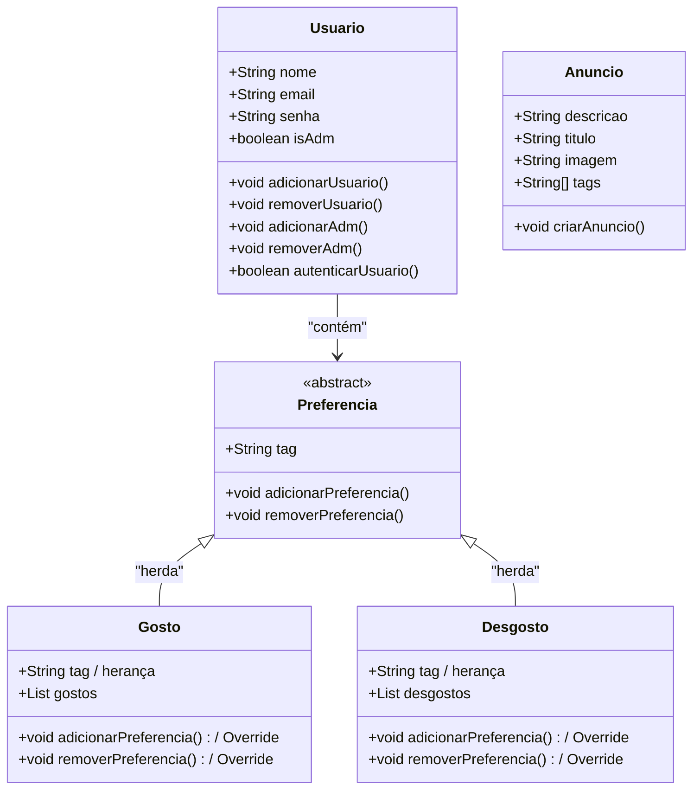
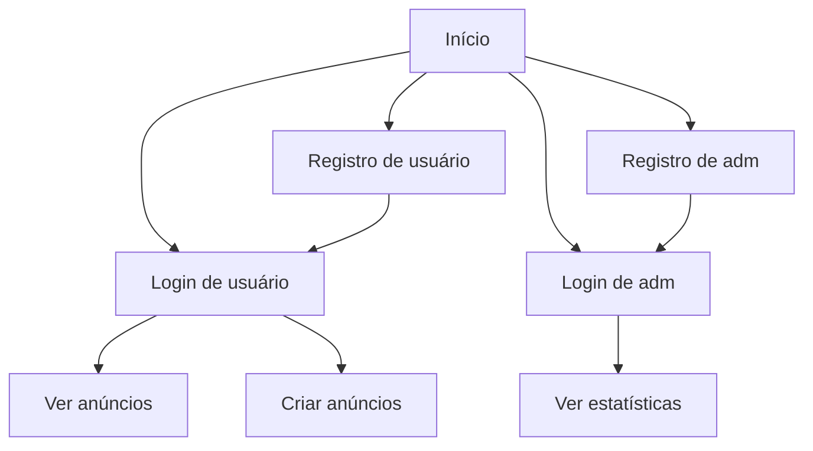
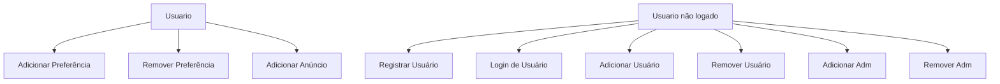

# Escopo
# Contexto

Uma empresa de marketing deseja uma aplicação para analisar as preferências de cada usuário e direcionar a eles apenas anúncios de seu interesse. A aplicação deve ser desenvolvida tendo em mente que futuramente ela poderá ser implementada em plataformas e aplicações de terceiros.

# Ferramentas

- Linguagem de desenvolvimento: Java
- Manipulação e persistência de dados: Serialização local (data.txt)
- Interface do usuário: Java Swing

# Escopo

## Objetivos:

- **Personalização de Anúncios:** Desenvolver um sistema que analisa as preferências de cada usuário para oferecer anúncios relevantes.
- **Melhorar a Experiência do Usuário:** Criar uma interface amigável que permita aos usuários navegar facilmente e interagir com os anúncios.
- **Coleta de Dados:** Implementar um sistema para coletar e armazenar dados sobre as interações dos usuários com os anúncios, ajudando na análise de desempenho.
- **Relatórios de Desempenho:** Fornecer relatórios detalhados sobre a eficácia dos anúncios.
- **Escalabilidade:** Garantir que a aplicação possa ser facilmente expandida para incluir novas funcionalidades e integrar-se a outras plataformas.

## Funcionalidades:

- **Cadastro de Usuários:** Permitir que os usuários se cadastrem e criem perfis personalizados.
- **Análise de Preferências:** Implementar algoritmos que analisem as preferências dos usuários com base em suas interações anteriores.
- **Criação e Exibição de Anúncios:** Desenvolver um sistema para criar e exibir anúncios com base nas preferências identificadas.
- **Feedback do Usuário:** Permitir que os usuários forneçam feedback sobre os anúncios que visualizaram, melhorando a personalização.
- **Persistência de Dados:** Utilizar serialização local para armazenar os dados dos usuários e seus comportamentos em um arquivo `.txt`.
- **Interface Gráfica:** Desenvolver uma interface com Java Swing que seja intuitiva e responsiva.
- **Histórico de Interações:** Manter um registro do histórico de visualizações dos usuários para análises futuras.
- **Configurações de Privacidade:** Permitir que os usuários gerenciem suas configurações de privacidade e decidam quais dados desejam compartilhar.
- **Relatórios:** Analistas autorizados podem gerar relatórios sobre os anúncios e as preferências de usuários.

## Desenvolvimento:

### Classes:

### Fluxo:

### Uso:

# Manual do Usuário

## Visão Geral
Este aplicativo permite que os usuários e administradores gerenciem registros de anúncios, realizem login e registro, e visualizem anúncios filtrados com base em preferências. O aplicativo é dividido em duas interfaces principais: a interface do usuário comum e a interface do administrador.

## 1. Tela Inicial (HomeView)

### Funcionalidades
A tela inicial oferece opções para registro e login de usuários e administradores. 

### Como Usar
- **Registrar Usuário**: Clique no botão "Registrar Usuário" para abrir a janela de registro.
- **Login Usuário**: Clique no botão "Login Usuário" para abrir a janela de login.
- **Registrar Administrador**: Clique no botão "Registrar Administrador" para abrir a janela de registro de administradores.
- **Login Administrador**: Clique no botão "Login Administrador" para abrir a janela de login para administradores.

### Registro de Usuário
1. Preencha os campos **Nome**, **Email** e **Senha**.
2. Clique em **Cadastrar**. Uma mensagem será exibida confirmando o cadastro.

### Login de Usuário
1. Insira seu **Email** e **Senha**.
2. Clique em **Login**. Se o login for bem-sucedido, você será redirecionado para a tela de visualização de anúncios.

### Registro de Administrador
1. Preencha os campos **Nome**, **Email** e **Senha**.
2. Clique em **Cadastrar**. Uma mensagem de confirmação será exibida.

### Login de Administrador
1. Insira seu **Email** e **Senha**.
2. Clique em **Login**. Se o login for bem-sucedido, você será redirecionado para a tela do painel do administrador.

---

## 2. Tela de Visualização de Anúncios (AnunciosView)

### Funcionalidades
Esta tela permite que os usuários visualizem anúncios filtrados com base em suas preferências.

### Como Usar
- **Navegar Anúncios**: Use os botões **Próximo** e **Anterior** para navegar entre os anúncios.
- **Saber Mais**: Clique em **Saber Mais** para ver os detalhes de um anúncio.
- **Não Tenho Interesse**: Clique em **Não Tenho Interesse** para informar que você não está interessado no anúncio atual.

### Detalhes do Anúncio
Ao clicar em **Saber Mais**, uma nova janela será aberta mostrando o título, descrição e imagem do anúncio.

---

## 3. Painel do Administrador (AdminView)

### Funcionalidades
A interface do administrador permite adicionar novos anúncios e gerar relatórios.

### Como Usar
- **Adicionar Anúncio**: Clique no botão **Adicionar Anúncio** para abrir a janela de adição de anúncios.
- **Gerar Relatórios**: Clique nos botões de relatório para gerar relatórios de anúncios, usuários, gostos e desgostos.

### Adicionar Anúncio
1. Preencha os campos **Título**, **Descrição**, e **Tags** (separadas por vírgula).
2. Clique em **Selecionar Imagem** para escolher uma imagem do seu sistema.
3. Clique em **Adicionar** para salvar o anúncio.

# Testes Realizados na Classe Anuncio

## Testes

1. **Teste: `testGetTitulo()`**
   - **Método**: `getTitulo()`
   - **Descrição**: Verifica se o método retorna o título correto.

2. **Teste: `testSetTitulo()`**
   - **Método**: `setTitulo()`
   - **Descrição**: Testa se o método atualiza o título corretamente.

3. **Teste: `testGetDescricao()`**
   - **Método**: `getDescricao()`
   - **Descrição**: Verifica se o método retorna a descrição correta.

4. **Teste: `testSetDescricao()`**
   - **Método**: `setDescricao()`
   - **Descrição**: Testa se o método atualiza a descrição corretamente.

5. **Teste: `testGetTagsAsString()`**
   - **Método**: `getTagsAsString()`
   - **Descrição**: Verifica se as tags são retornadas como uma string formatada corretamente.

6. **Teste: `testSetTags()`**
   - **Método**: `setTags()`
   - **Descrição**: Testa se o método armazena as tags corretamente.

# Testes Realizados na Classe Gostos

## Testes

1. **Teste: `testAdicionarPreferencia()`**
   - **Método**: `adicionarPreferencia()`
   - **Descrição**: Adiciona uma preferência e verifica se foi adicionada à lista.

2. **Teste: `testAdicionarPreferenciaDuplicada()`**
   - **Método**: `adicionarPreferencia()`
   - **Descrição**: Tenta adicionar a mesma preferência duas vezes e verifica se a lista contém apenas uma instância da tag.

3. **Teste: `testRemoverPreferencia()`**
   - **Método**: `removerPreferencia()`
   - **Descrição**: Adiciona uma preferência e depois a remove, verificando se a lista está vazia.

4. **Teste: `testRemoverPreferenciaInexistente()`**
   - **Método**: `removerPreferencia()`
   - **Descrição**: Tenta remover uma preferência que não existe e verifica se a lista permanece vazia.

5. **Teste: `testGetGostos()`**
   - **Método**: `getGostos()`
   - **Descrição**: Verifica se a lista de gostos está vazia inicialmente e se é atualizada após a adição de uma preferência.

# Testes Realizados na Classe Desgostos

## Testes

1. **Teste: `testAdicionarPreferencia()`**
   - **Método**: `adicionarPreferencia()`
   - **Descrição**: Adiciona uma desgosto e verifica se foi adicionada à lista.

2. **Teste: `testAdicionarPreferenciaDuplicada()`**
   - **Método**: `adicionarPreferencia()`
   - **Descrição**: Tenta adicionar a mesma desgosto duas vezes e verifica se a lista contém apenas uma instância da tag.

3. **Teste: `testRemoverPreferencia()`**
   - **Método**: `removerPreferencia()`
   - **Descrição**: Adiciona uma desgosto e depois a remove, verificando se a lista está vazia.

4. **Teste: `testRemoverPreferenciaInexistente()`**
   - **Método**: `removerPreferencia()`
   - **Descrição**: Tenta remover uma desgosto que não existe e verifica se a lista permanece vazia.

5. **Teste: `testGetDesgostos()`**
   - **Método**: `getDesgostos()`
   - **Descrição**: Verifica se a lista de desgostos está vazia inicialmente e se é atualizada após a adição de uma desgosto.

# Testes Realizados na Classe Usuario

## Testes

1. **Teste: `testGetNome()`**
   - **Método**: `getNome()`
   - **Descrição**: Verifica se o método retorna o nome correto do usuário.

2. **Teste: `testSetNome()`**
   - **Método**: `setNome()`
   - **Descrição**: Testa se o método atualiza o nome do usuário corretamente.

3. **Teste: `testGetEmail()`**
   - **Método**: `getEmail()`
   - **Descrição**: Verifica se o método retorna o email correto do usuário.

4. **Teste: `testSetEmail()`**
   - **Método**: `setEmail()`
   - **Descrição**: Testa se o método atualiza o email do usuário corretamente.

5. **Teste: `testGetSenha()`**
   - **Método**: `getSenha()`
   - **Descrição**: Verifica se o método retorna a senha correta do usuário.

6. **Teste: `testSetSenha()`**
   - **Método**: `setSenha()`
   - **Descrição**: Testa se o método atualiza a senha do usuário corretamente.

7. **Teste: `testIsAdmInicialmenteFalso()`**
   - **Método**: `isAdm()`
   - **Descrição**: Verifica se o usuário não é administrador inicialmente.

8. **Teste: `testSetAdm()`**
   - **Método**: `setAdm()`
   - **Descrição**: Testa se o método atualiza o status de administrador do usuário corretamente.

## Resultados:

Tests run: 6, Failures: 0, Errors: 0, Skipped: 0

------------------------------------------------------------------------
BUILD SUCCESS
------------------------------------------------------------------------
Total time:  6.861 s
Finished at: 2024-10-08T16:12:06-03:00
------------------------------------------------------------------------

3
Desgosto adicionado: tag1
Desgosto adicionado: tag1
Desgosto removido: tag1
------------------------------------------------------------------------
BUILD SUCCESS
------------------------------------------------------------------------
Total time:  4.515 s
Finished at: 2024-10-08T16:13:26-03:00
------------------------------------------------------------------------

3
Gosto adicionado: tag1
Gosto adicionado: tag1
Gosto removido: tag1
------------------------------------------------------------------------
BUILD SUCCESS
------------------------------------------------------------------------
Total time:  4.253 s
Finished at: 2024-10-08T16:13:58-03:00
------------------------------------------------------------------------

Tests run: 8, Failures: 0, Errors: 0, Skipped: 0

------------------------------------------------------------------------
BUILD SUCCESS
------------------------------------------------------------------------
Total time:  4.636 s
Finished at: 2024-10-08T16:14:25-03:00
------------------------------------------------------------------------